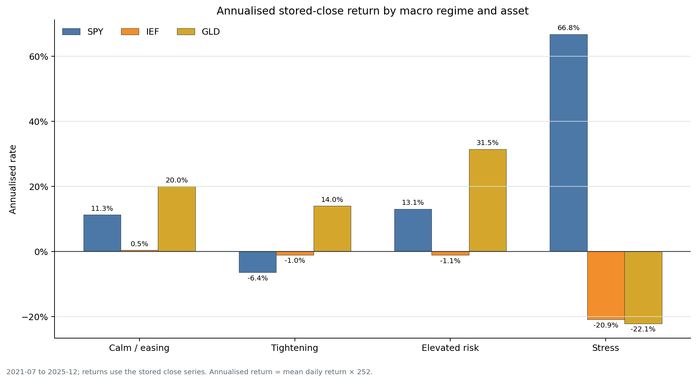
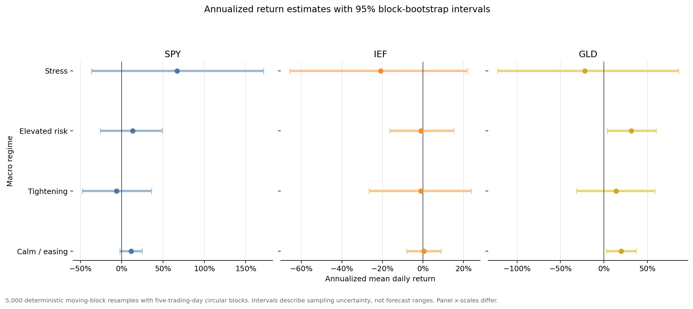
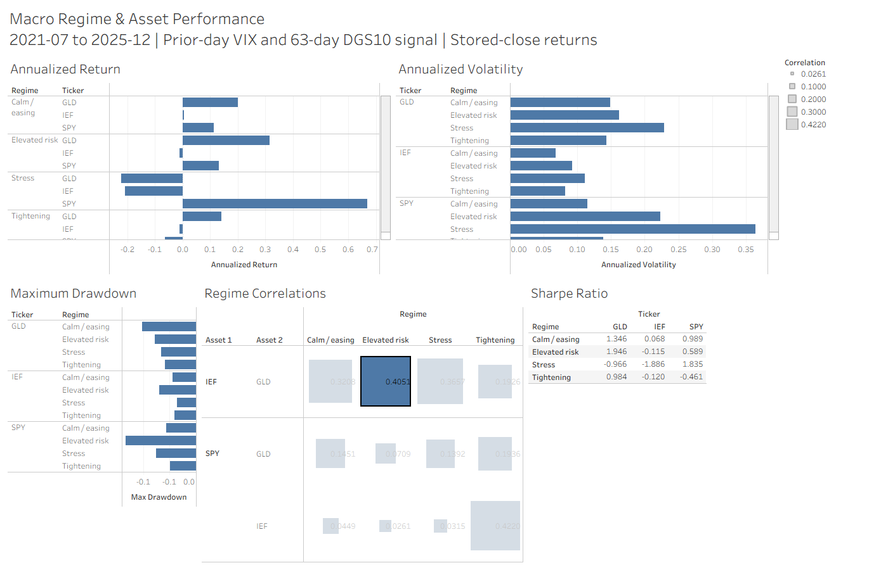

# Macro Regime & Asset Performance Analytics

An end-to-end financial analytics project that classifies daily US market regimes with transparent, lagged macro rules and measures how SPY, IEF, and GLD behaved in each state.

The portfolio question is deliberately narrow: **how did distribution-adjusted ETF returns differ when prior-day VIX and the recent direction of the US 10-year yield indicated calm, tightening, elevated risk, or stress?**

## Portfolio highlights

The common usable window is **7 July 2021 to 30 December 2025**, with 1,111 classified trading days after the 63-day warm-up and one-day signal lag.

1. **GLD's Tightening result is the most robust finding.** GLD has the highest annualized return in Tightening under all six tested VIX/yield threshold combinations.
2. **Elevated-risk leadership is threshold-sensitive.** GLD leads under the baseline VIX 20/30 definition, but not under every VIX 25/35 scenario.
3. **Stress estimates are not stable enough for a defensive-asset claim.** The Stress sample ranges from 8 to 62 days across scenarios, and the baseline SPY 95% block-bootstrap interval spans -36.7% to 171.5% annualized.





| Baseline regime | Days | Highest point estimate | 95% block-bootstrap interval |
|---|---:|---:|---:|
| Calm / easing | 619 | GLD: 20.0% | 2.9% to 37.1% |
| Tightening | 108 | GLD: 14.0% | -31.5% to 58.8% |
| Elevated risk | 322 | GLD: 31.5% | 3.6% to 59.8% |
| Stress | 62 | SPY: 66.8% | -36.7% to 171.5% |

Point estimates are descriptive annualized mean daily returns, not forecasts or investment recommendations.

## What this project demonstrates

- Multi-source data integration across Yahoo Finance, FRED, Bank of England, and ONS snapshots
- Explicit, one-day-lagged regime rules with documented thresholds and boundary handling
- Python data-quality checks, metric calculations, sensitivity analysis, and block-bootstrap uncertainty
- PostgreSQL raw → staging → mart scripts with validation and reconciliation queries
- Tableau, CSV, notebook, SQL, and static-chart deliverables

## Method at a glance

Rules use information available at the **previous trading close** and are evaluated in priority order:

| Regime | Baseline definition |
|---|---|
| Stress | VIX ≥ 30 |
| Elevated risk | 20 ≤ VIX < 30 |
| Tightening | VIX < 20 and 63-trading-day DGS10 change ≥ +0.50 percentage points |
| Calm / easing | VIX < 20 and 63-trading-day DGS10 change < +0.50 percentage points |

Returns use Yahoo Finance data downloaded with yfinance `auto_adjust=True`, explicitly incorporating splits and cash distributions. Annualized return is mean daily return × 252; volatility is sample daily standard deviation × √252; Sharpe uses a 0% risk-free rate; maximum drawdown is calculated within contiguous regime episodes.

See [detailed methodology](docs/methodology.md) and the [robustness and validation appendix](docs/validation.md).

## Reproduce

Python 3.13 was used for the verified run.

```bash
python -m venv .venv
.venv/Scripts/python -m pip install -r requirements.txt
.venv/Scripts/python scripts/download_adjusted_prices.py
.venv/Scripts/python -m src.build_analysis
.venv/Scripts/python -m src.robustness_analysis
.venv/Scripts/python scripts/generate_notebook.py
.venv/Scripts/python scripts/generate_robustness_notebook.py
.venv/Scripts/python -m jupyter nbconvert --execute --to notebook --inplace notebooks/01_macro_regime_analysis.ipynb --ExecutePreprocessor.timeout=180
.venv/Scripts/python -m jupyter nbconvert --execute --to notebook --inplace notebooks/02_robustness_uncertainty.ipynb --ExecutePreprocessor.timeout=180
.venv/Scripts/python tests/test_analysis.py
```

On macOS/Linux, replace `.venv/Scripts/python` with `.venv/bin/python`.

Reader-facing notebooks:

- [`01_macro_regime_analysis.ipynb`](notebooks/01_macro_regime_analysis.ipynb)
- [`02_robustness_uncertainty.ipynb`](notebooks/02_robustness_uncertainty.ipynb)

## Tableau deliverable

The self-contained, Tableau Public-compatible workbook is [`tableau/asset_performance_across_macro_regimes.twbx`](tableau/asset_performance_across_macro_regimes.twbx). It packages Hyper extracts generated from the current copies of:

- [`regime_asset_metrics.csv`](data/processed/regime_asset_metrics.csv)
- [`regime_correlations.csv`](data/processed/regime_correlations.csv)

The 1,400 × 900 dashboard reports annualized return, volatility, maximum drawdown, zero-risk-free-rate Sharpe ratio, and within-regime correlations across the four baseline regimes. No PostgreSQL server or machine-specific path is required. The packaged CSVs remain alongside the two Hyper extracts for auditability.

Asset colors are fixed across Python, notebooks, and Tableau: **SPY blue**, **IEF orange**, and **GLD gold/yellow**.



## Data and validation status

- Adjusted-price snapshot: 15,846 rows, SPY/IEF/GLD, 2005-01-03 to 2025-12-30
- Baseline outputs: 12 regime/asset metric rows and 12 regime/pair correlation rows
- Sensitivity outputs: 72 rows across six threshold scenarios
- Uncertainty outputs: 12 deterministic 95% moving-block bootstrap intervals
- PostgreSQL: the full pipeline was executed on PostgreSQL 18.3 on 16 July 2026; all 12 metric rows and 12 correlation rows matched the Python outputs with zero discrepancies

Source coverage and hashes are documented in [`data/source_manifest.csv`](data/source_manifest.csv), [`data/README.md`](data/README.md), and [`asset_prices_metadata.json`](data/raw/yahoo/asset_prices_metadata.json).

## Limitations

- The macro window begins in 2021 and excludes the Global Financial Crisis and initial COVID-19 shock.
- Regime thresholds are interpretable heuristics, not statistically estimated breakpoints.
- Stress observations are scarce and clustered; annualized point estimates are especially unstable.
- Five-day block bootstrapping captures only short-run dependence and does not resolve threshold-selection uncertainty.
- Results are conditional associations, not causal effects, forecasts, or investment recommendations.
