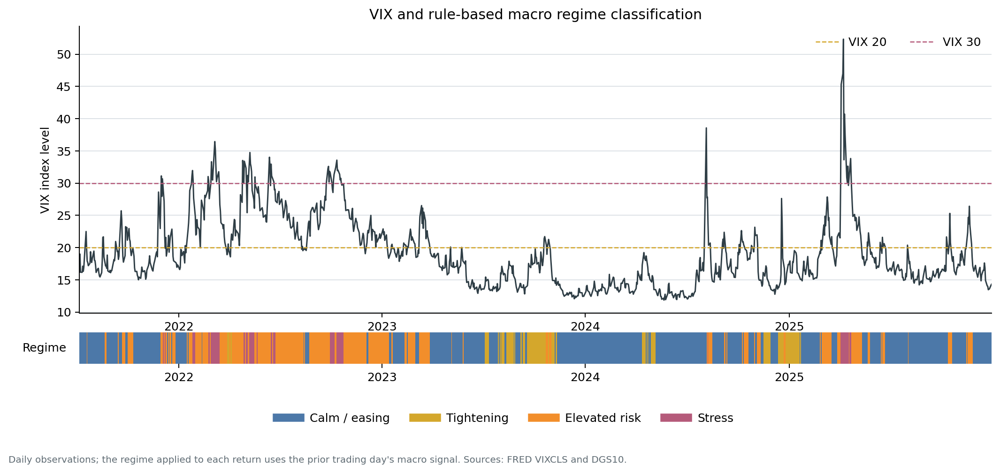
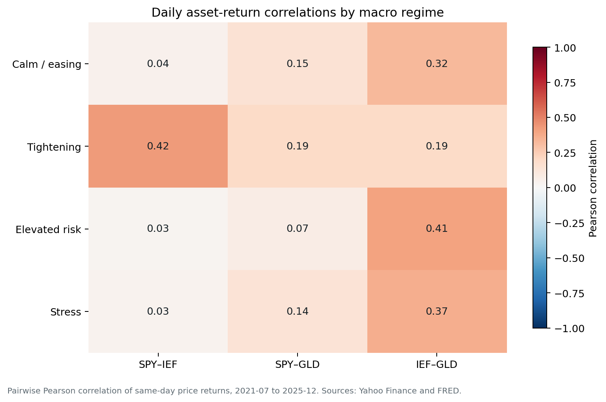

# Macro Regime & Asset Performance Analytics

An end-to-end financial analytics project that classifies daily market regimes with transparent rules and measures how US equities, intermediate Treasuries, and gold behaved in each state.

The portfolio question is deliberately narrow: **how did SPY, IEF, and GLD price returns differ when prior-day volatility and the recent direction of the US 10-year yield indicated calm, tightening, elevated risk, or stress?**



## What this project demonstrates

- Multi-source data integration across Yahoo Finance, FRED, Bank of England, and ONS snapshots
- Reproducible Python analysis and a fully executable reader-facing notebook
- PostgreSQL raw → staging → mart transformations, validation checks, and analysis queries
- Explicit regime thresholds, boundary handling, lag logic, and known limitations
- Quantified return, volatility, maximum drawdown, Sharpe ratio, and correlation results
- Tableau workbook handoff plus versioned CSV and PNG outputs

## Headline results

The common usable window is **7 July 2021 to 30 December 2025**. It contains 1,111 classified trading days after the 63-day warm-up and one-day signal lag.

| Regime | Asset | Days | Ann. return | Ann. volatility | Max drawdown | Sharpe (rf = 0%) |
|---|---:|---:|---:|---:|---:|---:|
| Calm / easing | SPY | 619 | 11.3% | 11.4% | -5.7% | 0.99 |
| Calm / easing | IEF | 619 | 0.5% | 6.8% | -4.4% | 0.07 |
| Calm / easing | GLD | 619 | 20.0% | 14.9% | -10.1% | 1.35 |
| Tightening | SPY | 108 | -6.4% | 13.8% | -5.0% | -0.46 |
| Tightening | IEF | 108 | -1.0% | 8.2% | -4.1% | -0.12 |
| Tightening | GLD | 108 | 14.0% | 14.3% | -5.9% | 0.98 |
| Elevated risk | SPY | 322 | 13.1% | 22.3% | -13.3% | 0.59 |
| Elevated risk | IEF | 322 | -1.1% | 9.3% | -6.9% | -0.11 |
| Elevated risk | GLD | 322 | 31.5% | 16.2% | -7.7% | 1.95 |
| Stress | SPY | 62 | 66.8% | 36.4% | -7.5% | 1.84 |
| Stress | IEF | 62 | -20.9% | 11.1% | -3.5% | -1.89 |
| Stress | GLD | 62 | -22.1% | 22.9% | -6.6% | -0.97 |

Three results matter more than generic “defensive asset” claims:

1. **GLD led during Tightening and Elevated risk**, while both SPY and IEF were negative in Tightening.
2. **IEF was not consistently defensive in this sample**, which is plausible for a period dominated by inflation and rate shocks.
3. **The Stress estimate is fragile.** Only 62 days qualify; SPY's positive annualised mean is paired with 36.4% volatility and is interpreted as short-horizon rebound behaviour, not a stable defensive premium.

Annualised return is the arithmetic mean daily return × 252. Returns use the stored `close_price` series. The legacy extraction did not preserve yfinance's `auto_adjust` setting, so distribution-adjustment status is not claimed. Maximum drawdown is the worst peak-to-trough loss within a contiguous episode of the regime.


## Regime methodology

The model is deterministic, descriptive, and intentionally easy to audit. It was not trained or optimised against asset performance.

Rules are evaluated in priority order using the **previous trading day's** signals:

| Regime | Exact definition |
|---|---|
| Stress | VIX ≥ 30 |
| Elevated risk | 20 ≤ VIX < 30 |
| Tightening | VIX < 20 and the 63-trading-day change in DGS10 ≥ +0.50 percentage points |
| Calm / easing | VIX < 20 and the 63-trading-day change in DGS10 < +0.50 percentage points |
| Unclassified | A required signal is missing or the 63-day history is not yet available |

Boundary cases are therefore unambiguous: VIX = 30 is Stress, VIX = 20 is Elevated risk, and a yield change of exactly +0.50 pp is Tightening. Stress and Elevated risk take precedence over the yield rule.

Why lag the signal by one day? Using the closing VIX to classify the same day's SPY return creates a mechanical contemporaneous relationship. The one-day lag ensures every regime label uses information that was already observable before the classified return.

### Metric definitions

- **Annualised return:** mean daily stored-close return × 252
- **Annualised volatility:** sample standard deviation of daily returns × √252
- **Maximum drawdown:** lowest peak-to-trough return within any contiguous episode of a regime
- **Sharpe ratio:** annualised return ÷ annualised volatility, with a documented 0% risk-free rate
- **Correlation:** Pearson correlation of same-day asset price returns within each regime

| Regime | SPY–IEF | SPY–GLD | IEF–GLD |
|---|---:|---:|---:|
| Calm / easing | 0.04 | 0.15 | 0.32 |
| Tightening | 0.42 | 0.19 | 0.19 |
| Elevated risk | 0.03 | 0.07 | 0.41 |
| Stress | 0.03 | 0.14 | 0.37 |



## Data sources and freshness

| Source | Snapshot coverage | Use |
|---|---|---|
| [Yahoo Finance](https://finance.yahoo.com/) — SPY, IEF, GLD | 2005-01-03 to 2025-12-30 | Model input |
| [FRED VIXCLS](https://fred.stlouisfed.org/series/VIXCLS) | 2021-04-07 to 2026-04-07 | Model input |
| [FRED DGS10](https://fred.stlouisfed.org/series/DGS10) | 2021-04-06 to 2026-04-06 | Model input |
| [Bank of England Bank Rate](https://www.bankofengland.co.uk/boeapps/database/Bank-Rate.asp) | 1975-01-20 to 2025-12-18 | Supplementary SQL source |
| [ONS consumer price indices](https://www.ons.gov.uk/economy/inflationandpriceindices/datasets/consumerpriceindices) | Varies | Supplementary provenance |

Outputs were rebuilt on **15 July 2026** from the stored snapshots. The original extraction did not preserve download timestamps, so the repository reports audited coverage dates rather than invented retrieval dates. Full lineage is in [`data/source_manifest.csv`](data/source_manifest.csv) and [`data/README.md`](data/README.md).

BoE and ONS files are not inputs to the current US-asset classifier. Mixing UK policy/inflation data into a US volatility/yield rule without a regional and mixed-frequency design would weaken interpretation; this scope boundary is explicit.

## Reproduce the analysis

Python 3.13 was used for the verified run.

```bash
python -m venv .venv
.venv/Scripts/python -m pip install -r requirements.txt
.venv/Scripts/python -m src.build_analysis
.venv/Scripts/python -m jupyter nbconvert --execute --to notebook --inplace notebooks/01_macro_regime_analysis.ipynb --ExecutePreprocessor.timeout=180
```

On macOS/Linux, replace `.venv/Scripts/python` with `.venv/bin/python`.

The build recreates every file in `data/processed/` and `outputs/figures/`. The executed notebook is the main analysis narrative: [`notebooks/01_macro_regime_analysis.ipynb`](notebooks/01_macro_regime_analysis.ipynb).

### PostgreSQL reproduction

From the repository root:

```bash
psql -d macro_project -f sql/00_schema.sql
psql -d macro_project -f sql/01_load_raw.sql
psql -d macro_project -f sql/02_transform_regimes.sql
psql -d macro_project -f sql/04_validation.sql
psql -d macro_project -f sql/03_analysis_queries.sql
```

The SQL pipeline mirrors the Python method, including as-of joins, the 63-trading-day change, one-day signal lag, regime boundaries, performance metrics, episode drawdowns, and correlations. See [`sql/README.md`](sql/README.md).

## Tableau deliverable

The packaged workbook is [`tableau/asset_performance_across_macro_regimes.twbx`](tableau/asset_performance_across_macro_regimes.twbx). It is fully self-contained and connects only to the packaged copies of [`data/processed/regime_asset_metrics.csv`](data/processed/regime_asset_metrics.csv) and [`data/processed/regime_correlations.csv`](data/processed/regime_correlations.csv).

The 1,400 x 900 dashboard compares GLD, IEF, and SPY across the four documented regimes (Calm / easing, Tightening, Elevated risk, and Stress). It reports annualized return, annualized volatility, maximum drawdown, zero-risk-free-rate Sharpe ratio, and within-regime asset correlations.


The generated Python figures and processed tables remain the source of truth for the quantitative claims in this README. The Tableau dashboard is a presentation layer over those exact processed outputs.

## Repository structure

```text
.
├── data/
│   ├── raw/
│   │   ├── boe/
│   │   ├── fred/
│   │   ├── ons/
│   │   └── yahoo/
│   ├── processed/
│   ├── README.md
│   └── source_manifest.csv
├── notebooks/
│   └── 01_macro_regime_analysis.ipynb
├── outputs/
│   ├── dashboard_exports/
│   └── figures/
├── scripts/
│   └── generate_notebook.py
├── sql/
│   ├── 00_schema.sql
│   ├── 01_load_raw.sql
│   ├── 02_transform_regimes.sql
│   ├── 03_analysis_queries.sql
│   ├── 04_validation.sql
│   └── README.md
├── src/
│   └── build_analysis.py
├── tableau/
│   └── asset_performance_across_macro_regimes.twbx
├── requirements.txt
└── README.md
```

## Limitations

- The analysis begins in 2021 because the stored FRED snapshots do; it does not cover the Global Financial Crisis or the initial COVID-19 shock.
- The legacy asset extract does not preserve yfinance's adjustment setting, so the stored close series cannot be described conclusively as adjusted or unadjusted.
- Regime thresholds are interpretable heuristics, not statistically estimated breakpoints.
- The 62-day Stress sample is small and clustered into episodes; annualised statistics can be unstable.
- Results are conditional associations, not causal effects, forecasts, or investment recommendations.
