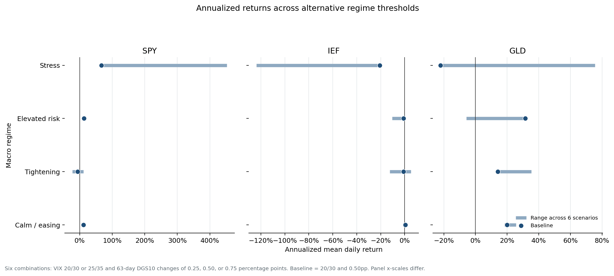

# Robustness and Validation Appendix

## Data provenance

The asset snapshot was rebuilt with an explicit yfinance `auto_adjust=True` setting. The download returned 15,846 unique `(date, ticker)` rows covering SPY, IEF, and GLD from 2005-01-03 to 2025-12-30. The analysis window remains 2021-07-07 to 2025-12-30 because FRED coverage and the 63-day warm-up are binding.

## Threshold sensitivity

Six scenarios combine VIX boundaries of 20/30 or 25/35 with DGS10-change thresholds of +0.25pp, +0.50pp, or +0.75pp.

| Finding | Result across six scenarios |
|---|---|
| GLD leads Tightening | 6 of 6 |
| GLD leads Elevated risk | 3 of 6 |
| IEF Tightening return is negative | 4 of 6 |
| SPY Stress return is positive | 6 of 6 |
| Stress observations | 8 to 62 days |

The large Stress ranges are an analytical result rather than a chart defect: raising the Stress boundary to VIX 35 leaves only eight observations, making annualized values extremely unstable.

## Block-bootstrap intervals

The 95% intervals use 5,000 circular moving-block resamples with five-trading-day blocks and seed 20260715.

Only Calm/easing GLD and Elevated-risk GLD have baseline 95% intervals above zero. Tightening GLD remains the relative leader across threshold scenarios, but its baseline return interval still includes zero. Stress intervals are extremely wide for all three assets.

Exact interval rows are versioned in `data/processed/regime_return_confidence_intervals.csv`; all scenario metrics are in `data/processed/robustness_metrics.csv`.

## Tableau package validation

`scripts/package_tableau_workbook.py` replaces the two packaged CSVs with the current processed files, rejects known legacy PostgreSQL/Hyper/regime references, and confirms byte-for-byte equality after packaging.

## SQL execution status

The PostgreSQL scripts are complete but have not been executed in this environment because neither PostgreSQL nor Docker is installed. The remaining live check is:

1. Run `sql/00_schema.sql` through `sql/04_validation.sql`.
2. Import Python's 12 metric rows and 12 correlation rows.
3. Run `sql/05_reconcile_python_outputs.sql` and require zero discrepancies.

This gap is stated explicitly rather than presenting reviewed SQL as executed SQL.
